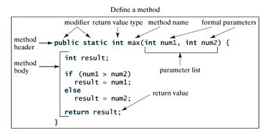

- 源文件名：源文件名必须和类名相同。当保存文件的时候,你应该使用类名作为保存(切记 java 是大小写敏感的),文件的后缀为.java(如果文件名和类名不相同则会导致编译错误。)

* 主方法入口:所有的 java 程序由 public static void main (String []args)方法开始执行

# java 修饰符

1. 访问控制修饰符 ： default, public , protected, private
2. 非访问控制修饰符: final, abstract, static, synchronized

# Java 对象和类

- Java 作为一种面向对象的语言。支持一下基本概念:
- 多态
- 继承
- 封装
- 抽象
- 类
- 对象
- 实例
- 方法
- 重载

* 局部变量:在方法、构造方法或者语句块中定义的变量被称为局部变量。变量声明和初始化都是在方法中,方法结束后,变量就会自动销毁。
* 成员变量:成员变量是定义在类中,方法体之外的变量。这种变量在创建对象的时候实例化。成员变量可以被类中方法、构造方法和特定类语块访问。
* 类变量:类变量也声明在类中,方法体之外,但必须声明为 static 类型

### 构造方法

- 每个类都有构造方法。如果没有显式为类定义构造方法,java 编译器将会为该类提供一个默认的构造方法。
- 在创建一个对象的时候,至少要调用一个构造方法。`构造方法的名称必须与类同名，一个类可以由多个构造方法`

```
public class Puppy {
  public Puppy(){

  }
 public Puppy(String name){
   // 这个构造器仅有一个参数 :name
 }

}

```

### 创建对象

- 对象是根据类创建的。在 java 中使用关键字 new 来创建一个新的对象。创建对象需要以下三步:
- 申明:声明一个对象,包括对象名称和对象模型。
- 实例化：使用关键字 new 来创建一个对象。
- 初始化：使用 new 创建对象时,会调用构造方法初始化对象

### 源文件声明规则

- 一个源文件中只能有一个 public 类
- 一个源文件可以由多个非 public 类
- 源文件的名称应该和 public 类的类名保持一致。例如：源文件中 public 类名 Employee,那么源文件应该命名为 Employee.java
- 如果一个类定义在某个包中,那么 package 语句应该在源文件的首行。
- 如果源文件包含 improt 语句,那么应该放在 package 语句和类定义之间。如果没有 package 语句,那么 import 语句应该在源文件中最前面。
- import 语句和 package 语句对源文件中定义的所有类都有效。在同一源文件中,不能给不同的类不同的包声明。

### java 包

- 包主要用来对类和接口进行分类。当开发 java 程序时,可能编写成百上千的类,因此很有必要对类和接口进行分类。

### import 语句

- 在 java 中,如果给出一个完整的限定名,包括包名、类名、那么 java 编辑器就可以很容易定位到源代码或者类。import 语句就是用来提供一个合理的路径,使得编译器可以找到某个类。

# java 基本数据类型

## 自动类型转换

- 整型、实型(常量)、字符型数据可以混合运算。运算中,不同类型的数据先转化为同一类型,然后进行运算。
- 转换从低到高级
- byte,short,char -> int -> long -> float-> double

# Java 变量类型

# Java 修饰符

- 修饰符用来定义类、方法或者变量、通常放在语句的最前端。

* 方法的定义  
  

# 方法的重载
* 一个类的两个方法拥有相同的名字,但是有不同的参数列表,返回类型可相同也可以不同。
* java编译器根据方法名判断哪个方法应该被调用
* 重载的方法必须拥有不同的参数列表。

# Java 流(Stream)、文件(File)和 IO

- java.io 包含几乎包含了所有操作输入、输出需要的类。所有的这些流类代表了输入源和输出目标。
* Java Scanner类 获取用户的输入

# Java异常处理

# 继承
* extends 
* implements

# Java重写（Override） 与重载(Overload)

# 多态
* 多态是同一个行为具有多个不同的表现形式或形态的能力

# 抽象类
* 如果一个类中没有包含足够的信息来描述一个具体的对象，这样的类就是抽象类。
* 抽象类除了不能实例化对象外,类的其他功能依然存在,成员变量 成员方法和构造方法的访问方式和普通类一样。

* 实例中,实例化了两个Salarh对象：一个使用Salary引用 s 另一个是 Employee
* s.mailCheck时，编译时会在Salary类中找到mailCheck(),执行过程中JVM
就调用Salary类的mailCheck();
* e是Employee的引用,所以调用e的mailCheck()方法时，编译器会去Employee类找
mailChecki()方法
* 在编译的时候,编译器使用Employee类中的mailCheck方法验证该语句，但是在运行
的时候,java虚拟机(JVM)调用的是Salary类中的mailCheck()

## 数组
* 数组是一个类型 固定长度 的  包含了相同类型 数据的 容器
 
 ## 单例模式
 1. 构造方法私有化
 2. 静态属性指像实例
 3. public static 的getInstance方法，返回第二步的静态属性。
 
 ## 接口
 * 接口就像是一种约定
 
 ## 对象转型
 1. 引用类型
 2. 对象类型
 
 3. 子类转换父类
 4. 木有继承关系的两个类,相互转化,一定会失败
 5. 实现类转换成接口(向上转型)
 
 ## 多态
1. 操作符的多态  
+ 可以作为算数运算,也可以作为字符串连接
* 类的多态 父类引用指向子类对象
 
 ### 类多态条件
 * 要实现类的多态，需要如下条件
 1. 父类(接口)引用执向子类对象
 2. 调用的方法重写
 
 * 与重写类似,方法的重写是 子类覆盖父类的 对象方法
 * 隐藏,就是子类覆盖父类的 类方法
 
 ## super
 
 ## Object 类是所有类的 父类
 * 申明一个类的时候,默认是继承了Object
 * Object类提供了一个toString方法，所以所有的类都有toString
 * toString()的意思是返回当前的对象的字符串表达。
 
 * 当它被垃圾回收的时候,finalize()方法 就会被调用
 * finalize()不是开发人员主动调用的方法,而是由虚拟机JVM调用的。
 * equals()用于判断两个对象的内容是否相同。
 * == 不是Objec的方法，但是用于判断两个对象是否相同。更准确的讲，用于判断两个引用，是否指向了同一个对象。
 

### final
1. final 修饰类
* 当Hero被修饰成final的时候,表示Hero不能够被继承
2. final修饰 方法
* Hero的useItem方法修饰成final，那么该方法在ADHero中，不能被重写
3. final修饰基本变量
* final修饰基本变量，表示该变量只有一次赋值机会。
4. final修饰引用
* h引用被修饰成final,表示该引用只有 1 次 指向对象的机会。
5. 常量

### 抽象类
* 在类中申明一个方法,这个方法没有实现体,是一个 "空"方法。这个方法就叫 抽象方法 使用修饰符 abstract
* 当一个类有抽象方法的时候，该类必须声明为抽象类。
* 一旦一个类被声明为抽象类,就不能被直接实力化

#### 抽象类和接口的区别
1. 子类只能继承一个抽象类,不继承多个   子类可以继承多个 接口
2. 抽象类可以定义 public protected package private  静态和非静态数据  final 和 final属性
3. 接口中申明的属性 只能是  public  静态  final
4. 注: 抽象类和接口都可以有实体方法。 接口中的实体方法，叫做默认方法

### 内部类分为四种
1. 静态内内部类
* new 外部类().new内部类()
* 可以直接访问外部类的private实例属性name的
2. 非静态内部类
* 静态内部类 不需要一个外部类的实例为基础,可以直接实例化
* new 外部类.静态内部类()
* 因为没有一个外部类的实例,所以在静态内部类里面 不能访问外部类的实例属性和方法。
* 可以访问 外部类的私有静态成员外 和普通类没啥区别
3. 匿名类
4. 本地类

### 默认方法

* this() 调用其他构造方法

### 类  接口  继承 


# 封装类
* 所有的基本类型,都有对应的 类类型 这中类型 叫做 封装类
* 自动封箱 
* 自动拆箱
* String.valueOf(i)
* it.toString()
* Integer.parseInt(str)
* Math.round()
* Math.random()
* Math.sqrt()
* Math.pow()
* 字符 字符串

* subString
* split
* trim
* toLowerCase
* toUpperCase
* indexOf
* equals

### StringBuffer是可变长的字符串
* append追加 delete 删除 insert 插入 reverse 反转

### Date
* SimpleDateFormat 日期格式化类
* format 日期转字符串
* parse 字符串转日期

* Calendar类即日历类，常用于进行“翻日历”，比如下个月的今天是多久
* Calendar.getInstance().setTime(new Date(0))
* add方法，在原日期上增加年/月/日
  set方法，直接设置年/月/日
  
  ## 集合
  * 容器的容量 capacity会随着对象的增加自动增长
  * ArrayList
  * add
  * contains
  * get
  * indexOf
  * remove
  * set
  * size
  * toArray
  * addAll
  * clear
  
  ### 泛型
  * List<Hero> heros  = new ArrayList<Hero>();
  * ArrayList heroList<? extends Hero> 表示这是一个Hero 泛型或者其子类泛型
  heroList的泛型可能是Hero/APHero/ADHero
  * 可以确凿的是，从heroList取出来的对象，一定是可以转型成Hero的。
  * ArrayList heroList<? super Hero> 表示这是一个Hero泛型或者其父类泛型
  * heroList的泛型可能是Hero/Object
  * ? 通配符
  * 子类泛型 不可以 转换为父类泛型
  
  ## lanbda

## 创建多线程的三种方式
1. 继承线程类
2. 实现Runnable类
3. 匿名类
## 常见线程方法

### 当前线程暂停
1. Thread.sleep(1000) 表示当前线程暂停1000毫秒,其他线程不受影响
2. Thread.sleep(1000) 会抛出InterruptedExecption中断异常。因为当前线程sleep的时候,有可能被停止,这时就会抛出InterruptedExecption
### 加入到当前线程中
3. 主线程 所有进程,至少有一个线程即主线程，即main方法开始执行,就会有一个看不见的主线程存在。
4. t1.join() 在主线程中加入该线程。
### 线程优先级
5. 当线程处于竞争关系的时候,优先级高的线程会有更大的几率获得CPU资源。
6. t1.setPriority(Thread.MAX_PRIORITY)
7. t2.setPriority(Thread.MIN_PRIORITY)
### 临时暂停
* 当前线程 零时暂停 使得1其他线程可以有更多的机会占有CPU资源
* Thread.yield()
### 守护线程
* 守护线程的概念是: 当一个进程里，所有的线程都是守护线程的时候,结束当前的进程。
* 如果一个进程只剩下守护线程,那么进程就会自动结束。
* 守护线程通常会被做来日志,性能统计等工作。

### 多线程 同步
* 多线程的同步问题指的是 多个线程同时修改一个数据的时候,可能导致的问题。
* 多线程的问题 又叫Concurrent 问题。
### 多线程 死锁
### 多线程交互
* this.wait()
* this.notify()
* wait notify 是在 Object上的方法
* 因为所有的Object都可以被用来作为同步对象,所以准确的讲,wait和 notify是同步对象上的方法。
### 多线程 线程池
* 每个线程的启动和结束都是比较耗时间和占资源的
* 如果在系统中用到了很多的线程,大量的启动和结束动作会导致系统的性能卡顿,响应变慢。
* 线程池
* 多线程 Lock对象
* 多线程 原子访问

## JDBC
* 访问Mysql数据库需要用到的第三方的类，这些第三方的类,都被压缩在一个叫做Jar的文件里。
* 为了代码能够使用第三方的类,需要为项目倒入mysql专用包Jar包
* 数据库的连接是有限资源，相关操作结束后,养成关闭数据库的好习惯，先关闭Statement 后关闭 Connection
### 使用事务
* 在事务中的多个操纵，要么都成功，要么都失败
* c.setAutoCommit(false) 关闭自动提交
* 使用 c.commit() 进行提交
* mysql表的类型必须是 INNODB才支持事务。
### 连接池
* 当有多个线程，每个线程都会创建一个连接,并且在使用完毕后，关闭连接
* 创建连接和关闭连接的过程也是比较消耗时间的，当多线程并发的时候,系统就会变得很卡顿。
* 同时,一个数据库同时支持的连接总数也是有限的,如果多线程并发量很大,那么数据库连接的总数就会被消耗光,后续线程发起大的数据库连接就会失败。

* 与传统方式不同,连接池在使用之前,就会创建好一定数量的连接。
* 如果有任何线程需要使用连接，那么就从连接池里面 借用 ，而不是自己重新创建。
* 使用完毕后，又把这个连接归还 给连接池 供下次或者 其他线程使用。
* 倘如发生多线程并发情况,连接池里面的连接被 借用光了，那么其他线程就会零时等待,直到有连接被归还回来。,再继续使用。
* 整个过程,这些连接都不会被关闭.而是不断的被循环使用,从而节约了启动和关闭连接的时间。

## 网络编程
* 在网络中每台计算机都必须有一个的IP地址
* 32位 4个字节
* 端口号
* 两台计算器进行连接,总有一台服务器,一台客户端。服务器和客户端之间的通信通过端口号进行。

### 使用Socket(套接字) 进行不同的程序之间的通信。

## 反射机制
### 获取类对象
1. Class.forName(className)
2. Hero.class
3. new Hero().getClass()
* 获取类对象的时候,会导致类属性被初始化

### 创建对象
* 反射机制,会先拿到Hero的类对象,然后通过类对象获取 构造器对象。
* 再通过构造器对象创建一个对象。
### 访问属性
* 通过反射机制修改对象的属性
* getField和getDeclaredField的区别 都是用于获取字段
1. getField 只能获取 public的, 包括从 父类继承 来的字段
2. getDeclaredField可以获取本类所有的字段,包括 private的,但是不能获取继承 来的字段
* (注： 这里只能获取到private的字段，但并不能访问该private字段的值,除非加上setAccessible(true))

* 调用方法
* 首先增加 setter 和 getter

### 反射机制的作用
* 通常来说,需要在学习了 spring的依赖注入,反转控制后,才会对反射有更好的理解。
### 注释
#### 基本内部注释
1. @Override
* @Override 用在方法上,表示这个方法重写了 父类的方法
* 如果父类 没有这个方法，那么就无法编译通过。
2. @Deprecated
* 表示这个方法已经过期,不建议开发者使用。(暗示在将来某个不确定的版本，就可能会取消掉)
3. @SuppressWarnings  Suppress英文的意思就是抑制的意思。这个注释的用处就是忽略警告信息。

* @SuppressWarnings({ "rawtypes", "unused" }) 就对这些警告进行了抑制，即忽略掉这些警告信息。
* @SuppressWarnings 有常见的值，分别对应如下意思
1. deprecation：使用了不赞成使用的类或方法时的警告(使用@Deprecated使得编译器产生的警告)；
2. unchecked：执行了未检查的转换时的警告，例如当使用集合时没有用泛型 (Generics) 来指定集合保存的类型; 关闭编译器警告
3. fallthrough：当 Switch 程序块直接通往下一种情况而没有 Break 时的警告;
4.path：在类路径、源文件路径等中有不存在的路径时的警告;
5.serial：当在可序列化的类上缺少 serialVersionUID 定义时的警告;
6.finally：任何 finally 子句不能正常完成时的警告;
7.rawtypes 泛型类型未指明
8.unused 引用定义了，但是没有被使用
9.all：关于以上所有情况的警告。

3. SafeVarargs 
@SafeVarargs 这是1.7 之后新加入的基本注解. 如例所示，当使用可变数量的参数的时候，而参数的类型又是泛型T的话，就会出现警告。 这个时候，就使用@SafeVarargs来去掉这个警告

@SafeVarargs注解只能用在参数长度可变的方法或构造方法上，且方法必须声明为static或final，否则会出现编译错误。一个方法使用@SafeVarargs注解的前提是，开发人员必须确保这个方法的实现中对泛型类型参数的处理不会引发类型安全问题。

以上解释很复杂，我也没搞明白，请忽略，往下学习。。。

4. FunctionalInterface

* @FunctionalInterface这是Java1.8 新增的注解，用于约定函数式接口。
  函数式接口概念： 如果接口中只有一个抽象方法（可以包含多个默认方法或多个static方法），该接口称为函数式接口。函数式接口其存在的意义，主要是配合Lambda 表达式 来使用。

* 自定义注释的 重要意思是拿到配置的 信息。再通过反射执行不同的方法。

## Log4j
* 与 Log4j入门 中的BasicConfigurator.configure();方式不同，采用指定配置文件
* PropertyConfigurator.configure("e:\\project\\log4j\\src\\log4j.properties");
